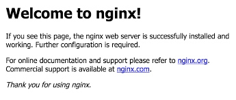

# Minikube Nginx Tutorial

## Prerequisite
- [Minikube](https://github.com/kubernetes/minikube/releases) 
- [Kubernetes command-line tool](http://kubernetes.io/docs/user-guide/prereqs/)

## Ready to go

Start minikube (specify memory)
```bash
minikube start --memory 8192
```

Check that Kubernetes is up and running
```bash
kubectl cluster-info
Kubernetes master is running at https://<IP addr>:8443
```
### Create nginx load balanced.

```bash
kubectl run nginx --image=nginx --port=80 --expose --service-overrides='{ "spec": { "type": "LoadBalancer" } }'
```
Check the replicas just wait a few seconds 

```bash
kubectl get pod
```

Check the internal IP 
```bash
kubectl get services
```

Find the external IP

```bash
minikube service nginx --url 
```


#### Enter into the container

Execute the following command with the name of your pod.
```bash
kubectl exec -ti nginx -- /bin/bash
```

Change the Nginx Page into the container and refresh
```bash
cd /usr/share/nginx/html/
rm index.html && echo "<html><body><h1>Hello Maria</h1></body></html>" > index.html
exit
```
#### Delete deployment

```bash
kubectl delete pod nginx
kubectl delete service nginx
```
